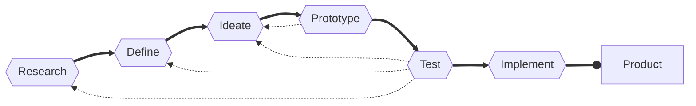

# :bust_in_silhouette: Zoomer Pro <em>voor Eric</em>

Repository voor het vak 👤 Human Centered Design. Dit vak is onderdeel van de minor Web Design &amp; Development.

Stefan Radouane

April 2023

## Onderzoeksvraag

Body language in chat apps.

## Probleemdefinitie

Schrijf hier wat het probleem is

## Oplossing

Schrijf hier hoe jij het probleem hebt opgelost, hoe werkt jouw prototype?

## Link prototype

[Link naar prototype](https://stefanradouane.github.io/hcd-repo/)

## :memo: Inhoudsopgave

- [De opdracht]()
- [Eerste test]()
- [Tweede test]()

## ℹ️ De opdracht

Hier komt een uitleg over de opdracht.

### 🥼 Testpersoon Eric

Eric is 50 jaar oud en woont in Amsterdam zijn spieren en pacen minder goed ontwikkeld. Hij is docent op de HvA, maar ook toegankelijkheidsmedewerker.

Hier komt een uitleg over Eric.

### 🔁 Iteraties proces

Tijdens dit project maken we gebruik van een iteratief process. Bij een iteratief process herhaal je fasen verschillende keren om uiteindelijk bij een product uit te komen. Het iteratief process ziet er als volgt uit:

## 🧪 Eerste test

De eerste test met Eric is op 20 april uitgevoerd. Zelf had ik een aantal vragen voorbereid die ik heb gesteld aan Eric. Ik heb de volgende vragen aan Eric gesteld.

- Wat vind u het aller grootste probleem waar je in het dagelijks leven tegen aan loopt.
- Zijn er dingen waar je jezelf toe beperkt voelt? Bijvoorbeeld wat is iets wat je graag zou willen doen maar wat helaas niet mogelijk is.
- Zou je misschien voor kunnen doen hoe je je telefoon gebruikt?

Naast deze vragen ben ik ook van plan om te vragen of Eric een aantal dingen kan testen op zijn telefoon.

### :microscope: Test resultaten

Eric maakt gebruik van een telefoon, maar niet op de wijze hoe mensen die wel hun handen volledig kunnen gebruiken. Hij maakt gebruik van een touch screen pen. Deze pen gebruikt Eric om zijn telefoon te bedienen, en het valt vrij snel op dat Eric enorm behendig is met deze pen en zijn telefoon. Omdat Eric zijn vingers niet volledig kan strekken, maar wel gebruik wil maken van bijvoorbeeld touch-id, heeft hij de zijkant van zijn vinger ingescanned. Eric heeft twee telefoons, één voor werk en de ander voor privé. Hij heeft op beide de zijkant van zijn vinger ingescanned en het valt op dat op zijn werk telefoon, een telefoon van een ander merk, veel beter reageerd op zijn vinger. Volgens Eric doet de touch-id zijn privé telefoon het de ene dag wel, en de andere dag niet. Eric is dus vrij behendig met zijn telefoon, maar heeft toch wel een aantal beperkingen met zijn gebruik van de telefoon. Als hij iets aan de bovenkant van het scherm wil indrukken, dan bedekt zijn hele hand het scherm en hij dus het scherm niet meer ziet. Daarnaast is zijn zoekvelden vaak klein en maakt hij dus het lieft gebruik van zijn laptop thuis, waar hij een grote monitor heeft staan.

To be continued...

## :alembic: Tweede test

To be continued...

## 🧫 Derde test

To be continued...

## App

Hier komt wat uitleg over de app:
To be continued...

## Criterea

- [ ] Maak verschillende ontwerpen, versies en varianten van je opdracht. Experimenteer met verschillende vormen van interactie en vormgeving. Wat werkt goed? Wat werkt niet goed?
      Beschrijf je test-persoon met een User Scenario.

- [ ] Test je ideeen en ontwerp elke week. Verbeter je ontwerp op basis van de feedback die je hebt gekregen uit de tests. Documenteer de testen goed.

- [ ] Leg de exclusive design principles uit en beschrijf hoe je die hebt toegepast.

- [ ] Zorg dat je voor de beoordeling in je Readme (of wiki) een conclusie schrijft waar je in gaat op de leerdoelen en criteria en hoe je dit hebt gehaald. Dit is je bewijsvoering voor het vak.
