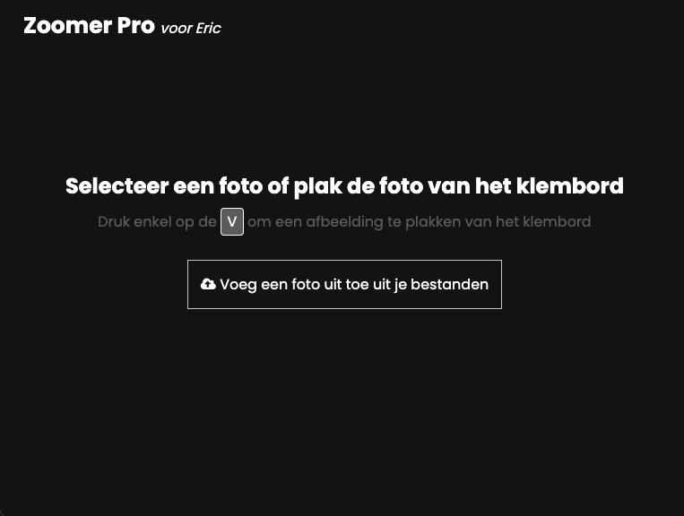
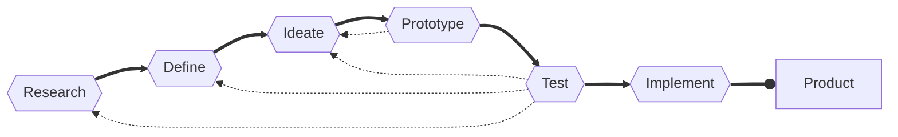
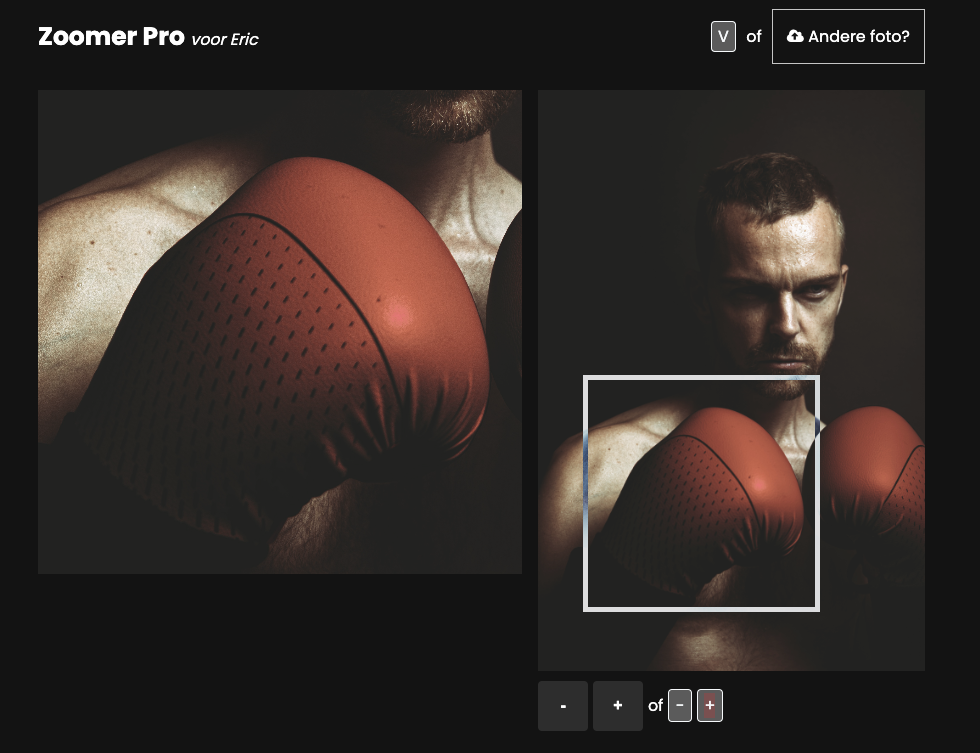

# :bust_in_silhouette: Zoomer Pro <em>voor Eric</em>

Door Stefan Radouane

## :thinking: Onderzoeksvraag

Voor Eric zijn emoji’s niet goed genoeg. Wij wil betere en krachtigere tools om emotie en <em>body language</em> te gebruiken in chat apps zoals Signal

## 🛰️ Probleemdefinitie

De onderzoeksvraag verteld dat Eric moeite heeft met emoji's en dat deze niet goed genoeg zijn. Ik ben in gesprek gegaan met Eric en uit dit gesprek bleek dat hij niet alleen moeite heeft met emoji's, maar dat het in- en uitzoomen van foto's ook erg lastig is. Vooral als het gaat over gestures. Swipe bewegingen, waar meer dan een vinger bij nodig is is dus ook een probleem waar Eric tegen aan loopt. Ik heb de priotiteit van dit project dus veranderd van emoji's naar gestures. Ik wil een manier vinden waarop Eric makkelijk kan in- en uitzoomen op foto's, zonder dat hij hierbij zijn vingers hoeft te gebruiken (of zo min mogelijk).

## :hammer_and_wrench: Oplossing

De oplossing die ik heb bedacht is een website waar Eric gemakkelijk foto's op kan in- en uitzoomen. Eric kan foto's in en uitzoomen doormiddel van een simpel interface. Met dit interface kan Eric gemakkelijk een foto's toevoegen uit zijn bibliotheek of van het klembord. Na het toevoegen van de foto kan hij met een soort van slider over de foto heen en ziet hij bovenaan de foto een preview van de ingezoomde foto. Hij kan met de slider over de foto heen schuiven en zo de preview orienteren. Hij kan de preview verder in- en uitzoomen met een knop of met de - en + toetsen op het toetsenbord. Zo kan Eric de foto in en uitzoomen zonder dat hij hiervoor gestures hoeft te gebruiken. Dit lost dus het probleem op dat Eric heeft met gestures.

## 🖇️ Link prototype

[Link naar prototype](https://stefanradouane.github.io/hcd-repo/)

---

# 📄 Documentatie

## :memo: Inhoudsopgave

- [De opdracht]()
- [Eerste test]()
- [Tweede test]()

## ℹ️ De opdracht

Hier komt een uitleg over de opdracht.

### 🥼 Testpersoon Eric

Eric is 50 jaar oud en woont in Amsterdam zijn spieren en pacen minder goed ontwikkeld. Hij is docent op de HvA, maar ook toegankelijkheidsmedewerker. Eric is een ontwerper. Hij organiseert regelmatig design-avonden waar hij probeert om mensen met beperkingen samen te brengen met ontwerpers en makers. Eric zelf zit in een electrische rolstoel. Hij heeft niet de beschikking over de fijne motoriek. Hij heeft ooit met studenten van de minor Makers Lab gewerkt. Eric wilde zijn hele leven al gitaar spelen, maar zijn handen staan daar niet goed voor. Zijn team studenten heeft toen een werkend prototype gemaakt van een apparaat waarmee hij gitaar kan spelen.

### 🔁 Iteraties proces

Tijdens dit project maken we gebruik van een iteratief process. Bij een iteratief process herhaal je fasen verschillende keren om uiteindelijk bij een product uit te komen. Het iteratief process ziet er als volgt uit:

## 🧪 Eerste test

De eerste test met Eric is op 20 april uitgevoerd. Zelf had ik een aantal vragen voorbereid die ik heb gesteld aan Eric. Ik heb de volgende vragen aan Eric gesteld.

- Wat vind u het aller grootste probleem waar je in het dagelijks leven tegen aan loopt.
- Zijn er dingen waar je jezelf toe beperkt voelt? Bijvoorbeeld wat is iets wat je graag zou willen doen maar wat helaas niet mogelijk is.
- Zou je misschien voor kunnen doen hoe je je telefoon gebruikt?

Naast deze vragen ben ik ook van plan om te vragen of Eric een aantal dingen kan testen op zijn telefoon.

### :microscope: Test resultaten

Eric maakt gebruik van een telefoon, maar niet op de wijze hoe mensen die wel hun handen volledig kunnen gebruiken. Hij maakt gebruik van een touch screen pen. Deze pen gebruikt Eric om zijn telefoon te bedienen, en het valt vrij snel op dat Eric enorm behendig is met deze pen en zijn telefoon. Omdat Eric zijn vingers niet volledig kan strekken, maar wel gebruik wil maken van bijvoorbeeld touch-id, heeft hij de zijkant van zijn vinger ingescanned. Eric heeft twee telefoons, één voor werk en de ander voor privé. Hij heeft op beide de zijkant van zijn vinger ingescanned en het valt op dat op zijn werk telefoon, een telefoon van een ander merk, veel beter reageerd op zijn vinger. Volgens Eric doet de touch-id zijn privé telefoon het de ene dag wel, en de andere dag niet. Eric is dus vrij behendig met zijn telefoon, maar heeft toch wel een aantal beperkingen met zijn gebruik van de telefoon. Als hij iets aan de bovenkant van het scherm wil indrukken, dan bedekt zijn hele hand het scherm en hij dus het scherm niet meer ziet. Daarnaast is zijn zoekvelden vaak klein en maakt hij dus het lieft gebruik van zijn laptop thuis, waar hij een groot monitor heeft staan. Uit de vragen bleek ook dat Eric moeite heeft gebruiken van gestures op zijn telefoon. Een foto in- en uitzoomen vind hij erg lastig. Hij maakt hierbij gebruik van twee vingers, maar dit gaat niet altijd goed. Eric heeft dus moeite met gestures, maar is wel erg behendig met zijn telefoon.

## :alembic: Tweede test

Voor de tweede test met Eric heb ik drie demo's voorbereid waarbij ik test hoe Eric omgaat met gestures. De demo's bestaan uit 3 zoekplaatjes waarbij het de bedoeling is dat Eric het voorbeeld zoekt. Ik heb de volgende demo's voorbereid:

- Demo 1: Inzoomen op een foto zonder hulpmiddel
- Demo 2: Inzoomen op een foto met met behulp van een slider over de foto.
- Demo 3: Inzoomen op een foto met behulp van een lens boven de foto.

Deze demo's zijn te bekijken op de volgende link: [Demo's](https://stefanradouane.github.io/hcd-repo/demo.html)

### 🧫 Test resultaten

Uit deze demo's bleek dat als Eric wilt in- en uizoomen met zijn telefoon hij de telefoon eerst op zijn electrische stoel leuning moet leggen. Op zijn leuning heeft hij namelijk een schuine ondergrond waar hij zijn telefoon op kan leggen. Als hij zijn telefoon op zijn leuning legt, dan kan hij met beide armen de foto in- en uitzoomen. De eerste demo was daarom voor Eric niet heel gemakkelijk. Bij de tweede demo ging het al een stuk eenvoudiger om met een slider over de foto heen te gaan. Boven de foto was de preview van het gedeelte van de slider en daarom kon hij dit eenvoudig met zijn hand bedienen. Voor de derde demo had Eric zijn stylus pen nodig, omdat de lens onder zijn vinger is geplaatst. Zijn hand beweegt dus over de lens heen wat het niet eenvoudig maakte.

> Uit de test bleek dus dat het voor Eric een stuk eenvoudiger was om met de slider over de foto heen te gaan, dan om een foto in- en uit te zoomen met gestures.

## :iphone: App

Ik heb deze bevindingen gebruikt om de uiteindelijke app te maken. Het doel van de app is het eenvoudig maken voor Eric om foto's in- en uit te zoomen. De app bestaat uit een slider die over de foto heen gaat. Deze slider is te bedienen met een stylus pen. Boven op mobiel of naast op desktop staat een preview waar Eric het ingezoomde gedeelte kan zien. Het formaat van de slider is aanpasbaar en kan dus op deze manier meer of minder inzoomen. Het formaat is aanpasbaar door `-` of `+` te drukken op het toetsenbord, of door de knoppen te gebruiken. Daarnaast kan Eric een foto toevoegen uit zijn bestanden of van zijn klembord. Hij kan een foto uit zijn klembord toevoegen door alleen op de `v` te klikken als deze is gekopieerd. De app is te bekijken op de volgende link: [App](https://stefanradouane.github.io/hcd-repo/)

---

Stefan Radouane

April - Mei 2023
